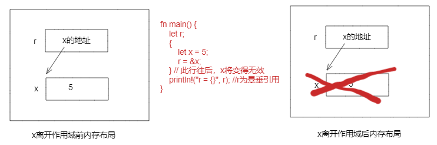

# 3.11 生命周期

Rust中的生命周期是用来管理内存的一种机制。在Rust中，内存的所有权和使用必须是确定的，生命周期就是用来确定内存的使用范围的（说的更具体点，就是确定引用的有效范围）:
- 编译器大多数时间能够自动推导生命周期（3.11.1和3.11.2中的例子编译器都能自动推导）；
- 在多种类型存在，且编译器无法推导某个引用的生命周期时，需要在代码中显式的标明生命周期。

## 3.11.1 悬垂指针和生命周期

生命周期的主要目的就是为了避免悬垂引用。考虑如下代码：

```rust
fn main() {
    let r;
    {
        let x = 5;
        r = &x;
    }
    println!("r = {}", r); //r为悬垂引用
}
```

上面代码中，x的有效作用域是从第4行到第6行花括号结束前，即从第6行的花括号后开始，x变为无效，r为x的应用，此时将指向的是一块无效的内存。其内存示意图如下：

  

## 3.11.2 借用检查

Rust编译器有一个借用检查器，用它来检查所有的应用的都是有效的，具体的方式为比较变量及其引用的作用域。

### 1. 示例1如下：

```rust
fn main() {
    let r;       //------------------------+-------'a
    {            //                        |
                 //                        |
        let x = 5;      //----+---'b       |
        r = &x;         //    |            |
    }                   //----+            |
    println!("r = {}", r);      //         |      //r为悬垂引用
} //---------------------------------------+
```

对于上面的代码，借用检查器将`r`的生命周期标注为`'a`，将x的生命周期标注为`'b`，然后比较`'a`和`'b`的范围，发现`'b < 'a`，被引用的对象比它的引用者存在的时间还短，然后编译报错。


### 2. 示例2如下：

```rust
fn main() {
    let x = 5;            // ----------+-- 'b
                          //           |
    let r = &x;           // --+-- 'a  |
                          //   |       |
    println!("r: {}", r); //   |       |
                          // --+       |
}                         // ----------+
```

对于上面的代码，借用检查器将x的生命周期标注为`'b`，将`r`的生命周期标注为`'a`，比较两者范围，发现`'b > 'a`，被引用对象比它的应用者存在的时间长，编译检查通过。

## 3.11.3 编译器有时无法自动推导生命周期

如下代码会报错：

```rust
fn longest(x: &str, y: &str) -> &str {
    if x.len() > y.len() {
        x
    } else {
        y
    }
}
fn main() {
    let s1 = String::from("abcd");
    let s2 = String::from("ad");
    let r = longest(s1.as_str(), s2.as_str());
}
```

原因为：***在存在多个引用时，编译器有时会无法自动推导生命周期，此时就需要程序员在代码中手动去标注，通过为参数标注合适的生命周期来帮助编译器进行借用检查的分析***。

## 3.11.4 标注生命周期

### 1. 生命周期标注的语法

在开始说明生命周期标注语法前，需要特别明确的是：生命周期标注并不会改变任何引用的实际作用域，标记的生命周期只是为了取悦编译器，让编译器不要难为代码。

生命周期标注的语法为：生命周期参数名称必须以撇号`'`开头，其名称通常全是小写，类似于泛型，其名称非常短。比较常见的是使用`'a`作为第一个生命周期标注。生命周期参数标注位于引用符号`&`之后，并有一个空格来将引用类型与生命周期注解分隔开。

下面为生命周期标注的例子：

```Rust
&i32        // 引用
&'a i32     // 带有显式生命周期的引用
&'a mut i32 // 带有显式生命周期的可变引用
```

### 2. 函数签名中的生命周期

对于3.11.3例子中的函数，显式标注生命周期后的代码如下：

```rust
fn longest<'a>(x: &'a str, y: &'a str) -> &'a str {
    if x.len() > y.len() {
        x
    } else {
        y
    }
}
```

上面代码中，对x和y标注生命周期为`'a`，返回的引用的生命周期也为`'a`。当调用这个函数时，就要求传入的`x`和`y`的生命周期必须是大于等于`'a`的。当不遵守这个规则的参数传入时，借用检查器就会报错。

### 3. 深入思考生命周期标注

（1）指定生命周期参数的正确方式依赖函数实现的具体功能。如下代码中将不用标注`y`的生命周期，因为返回值不依赖于y的生命周期。

```rust
fn longest<'a>(x: &'a str, y: &str) -> &'a str {
    x
}
```

（2）当从函数返回一个引用，返回值的生命周期参数需要与一个参数的生命周期参数相匹配。如果返回的引用没有指向任何一个参数，那么唯一的可能就是它指向一个函数内部创建的值，它将会是一个悬垂引用。如下代码将编译错误：

```rust
fn longest<'a>(x: &str, y: &str) -> &'a str {
    let result = String::from("really long string");
    result.as_str()  //将产生悬垂引用，result在花括号前“}”离开作用域
}
```

### 4. 结构体中的生命周期

结构体中的生命周期标注示例如下：

```rust
#[derive(Debug)]
struct A<'a> {
    name: &'a str,    // 标注生命周期
}

fn main() {
    let n = String::from("andy");
    let a = A { name: &n };
    println!("{:#?}", a);
}
```

### 5. 生命周期省略

在大多数情况下，程序员不用在代码中显式标注生命周期，因为编译器能自动推导。不标注生命周期，我们称之为生命周期省略。例如下面的代码可以正确编译：

```rust
fn get_s(s: &str) -> &str {
    s
}
```

关于生命周期省略有如下说明：

（1）遵守生命周期省略规则的情况下能明确变量的生命周期，则无需明确指定生命周期。函数或者方法的参数的生命周期称为输入生命周期，而返回值的生命周期称为输出生命周期。

（2）编译器采用三条规则判断引用何时不需要生命周期标注，当编译器检查完这三条规则后仍然不能计算出引用的生命周期，则会停止并生成错误。

（3）生命周期标注省略规则适用于fn定义以及impl块定义。

三条判断规则如下：

a、每个引用的参数都有它自己的生命周期参数。例如如下：
        一个引用参数的函数，其中有一个生命周期： `fn foo<'a>(x: &'a i32)`
        两个引用参数的函数，则有两个生命周期 ：`fn foo<'a, 'b>(x: &'a i32, y: &'b i32)`以此类推。

b、如果只有一个输入生命周期参数，那么它被赋予所有输出生命周期参数：

```Rust
fn foo(x: &i32) -> &i32   等价于  fn foo<'a>(x: &'a i32) -> &'a i32
```

c、如果方法有多个输入生命周期参数，不过其中之一因为方法的缘故为`&self`或者`&mut self`，那么`self`的生命周期被赋予所有输出生命周期参数。

### 6. 方法中的生命周期

结构体字段的生命周期必须总是在impl关键字之后声明并在结构体名称之后使用，这些声明周期是结构体类型的一部分，示例如下：

```rust
struct StuA<'a> {
    name: &'a str,
}
impl<'a> StuA<'a> {
    fn do_something(&self) -> i32 {
        3
    }
}
```

下面的例子中，其方法没有显式标注生命周期，因为它符合生命周期省略规则中的第三条规则，代码如下：

```rust
struct StuA<'a> {
    name: &'a str,
}
impl<'a> StuA<'a> {
    fn do_something2(&self, s: &str) -> &str {
        self.name //此处符合声明周期注解省略的第三条规则
    }
}
```

### 7. 静态生命周期

静态生命周期定义方式为：`'static`，其生命周期存活于整个程序期间。所有的字符字面值都拥有`'static`生命周期，代码中可以如下来标注：

```rust
let s: &'static str = "I have a static filetime";
```

### 8. 结合泛型参数、trait bounds和生命周期的例子

下面示例为在同一函数中指定泛型类型参数、trait bounds 和生命周期：

```rust
use std::fmt::Display;
fn longest_with_an_announcement<'a, T>(x: &'a str, y: &'a str, ann: T) -> &'a str
where
    T: Display,
{
    println!("Announcement! {}", ann);
    if x.len() > y.len() {
        x
    } else {
        y
    }
}
fn main() {
    let s1 = String::from("s1");
    let s2 = String::from("s2!");
    let ann = 128;
    let r = longest_with_an_announcement(s1.as_str(), s2.as_str(), ann);
    println!("r = {}", r);
    println!("Hello, world!");
}
```
