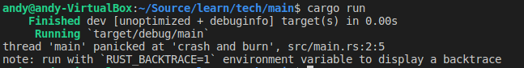

# 3.12 错误处理

Rust将错误分为两大类：可恢复的和不可恢复的错误。
- 可恢复错误通常代表向用户报告错误和重试操作是合理的情况，例如未找到文件。rust中使用```Result```来处理可恢复错误。
- 不可恢复错误是bug的同义词，如尝试访问超过数组结尾的位置。rust中通过```panic！```来实现。

## 3.12.1 用panic!处理不可恢复错误

`panic!`的使用方式如下：
```rust
fn main() {
    panic!("crash and burn");
}
```

运行该程序会打印如下错误：

 

运行时添加```RUST_BACKTRACE=1```，可以打印完整的堆栈，上面的代码运行时加```RUST_BACKTRACE=1```的结果如下：


## 3.12.2 用Result处理可恢复错误

### 1. Result的定义

Rust中使用```Result```类型处理可恢复错误，其定义如下：

```rust
enum Result<T, E> {
    Ok(T),
    Err(E),
}
```

```T```和```E```是泛型类型参数，```T```代表成功是返回的```Ok```成员中的数据类型，```E```代表失败是返回的```Err```成员中的错误的类型。

### 2. 使用Result

使用示例如下：

```rust
use std::fs::File;
fn main() {
    let f = File::open("hello.txt");
    let _r = match f {
        Ok(file) => {
            file
        },
        Err(error) => {
            panic!("Problem opening the file: {:?}", error)
        }
    };
}
```

第3行返回的结果就是一个```Result```类型，可以使用```match```匹配```Result```的具体类型。下面为使用```str```作为```Result<T, E>```中的错误```E```的例子：

```rust
// 该函数返回结果为Result<T, E>，其中T为（），E为具有静态生命周期的&str类型
fn produce_error(switch: bool) -> Result<(), &'static str> {
    if switch {
        return Err("This is a error");
    }

    Ok(())
}
fn main() {
    let result = produce_error(true);

    match result {
        Ok(_) => {
            println!("There is no error!");
        }
        Err(e) => {
            println!("Error is: {:?}", e);
        }
    }
}
```

### 3. 失败时直接panic的简写

对于返回```Result```类型的函数，不用总是使用```match```去匹配结果，还可以使用简写获取到```Result<T, E>```中的```T```类型，不过使用简写时，当```Result<T, E>```是```Err```时程序会panic：

#### 3.1 使用unwrap简写：

```rust
use std::fs::File;
fn main() {
    let f = File::open("hello.txt").unwrap();   //使用unwrap简写来获取到Result中的T类型，
                                                //当hello.txt打开失败时程序会panic
}
```

#### 3.2 使用except简写：

```rust
use std::fs::File;

fn main() {
    //使用unwrap简写来获取到Result中的T类型，
    //当hello.txt打开失败时程序会panic
    let greeting_file = File::open("hello.txt")
        .expect("hello.txt should be included in this project");
}
```

### 4. 传播错误

除了函数中处理错误外，还可以选择让调用者知道这个错误并决定如何处理，这叫做传播错误。示例如下：

```rust
fn produce_error(switch: bool) -> Result<(), &'static str> {
    if switch {
        return Err("This is a error");
    }
    Ok(())
}

fn transmit_error(flag: bool) -> Result<String, &'static str> {
    let s = produce_error(flag);
    match s {
        Ok(_) => return Ok("Hello".to_string()),
        Err(e) => return Err(e),
    }
}

fn main() {
    let result = transmit_error(true);

    match result {
        Ok(_) => {
            println!("There is no error!");
        }
        Err(e) => {
            println!("Error is: {:?}", e);
        }
    }
}
```

在上面的代码中，```transmit_error```中就没有自己处理错误，而是选择将错误传递给外层。

传播错误可以用```？```进行简写，上面的```transmit_error```函数代码用简写方式示例如下：

```rust
fn produce_error(switch: bool) -> Result<(), &'static str> {
    if switch {
        return Err("This is a error");
    }
    Ok(())
}

fn transmit_error(flag: bool) -> Result<String, &'static str> {
    produce_error(flag)?;   // 如果调用produce_error函数返回的是Err类型将会直接从此行返回

    println!("如果produce_error函数返回的是错误将不会执行到这里");
    Ok("Hello".to_string())
}

fn main() {
    // 下面的调用将不会打印"如果produce_error函数返回的是错误将不会执行到这里"
    let result1 = transmit_error(true);

    println!("+++++++++++++++++++++++++++++++++++++++++++++++");
    // 下面的调用将会打印"如果produce_error函数返回的是错误将不会执行到这里"
    let result2 = transmit_error(false);

    ...

}
```

下面是更复杂的简写：

```rust
use std::io;
use std::io::Read;
use std::fs::File;
fn read_username_from_file() -> Result {
    let mut s = String::new();
    //如果open()失败将直接把“打开失败错误”返回，如果read_to_string失败也将把“读取失败错误”返回
    File::open("hello.txt")?.read_to_string(&mut s)?;
    Ok(s)
}
```

```？```运算符被用于返回```Result```的函数，```Result```返回的是```Err```类型，则直接结束将错误传播到上一级。

## 3.12.3 什么时候使用panic

关于什么时候使用panic，什么使用Result，总结如下：

- 示例、代码原型和测试适合使用panic，使用Result可以使用unwrap、expect的方式；
- 实际项目中应该多使用Result，并且尽量少使用Result的unwrap、expect方式。
