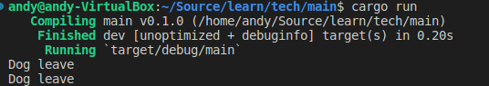

# 3.16.4 Drop trait
## 1. Drop trait
Drop trait类似于其它语言中的析构函数，当值离开作用域时执行此函数的代码。可以为任何类型提供Drop trait的实现。
为一个类型实现Drop trait的示例如下：
```Rust
struct Dog(String);

//下面为Dog实现Drop trait
impl Drop for Dog {
    fn drop(&mut self) {
        println!("Dog leave");
    }
}

fn main() {
    let _a = Dog(String::from("wangcai"));
    let _b = Dog(String::from("dahuang"));
}
```

运行该代码，会有如下结果：

