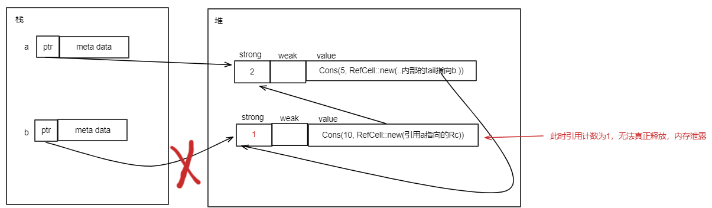

# 3.16.7 引用循环、内存泄露、Weak智能指针

## 1. 引用循环和内存泄露

下图是一个循环链表：


下面的代码试图用之前学到的智能指针相关知识实现上面的链表：

```rust
use crate::List::{Cons, Nil};
use std::cell::RefCell;
use std::rc::Rc;

#[derive(Debug)]
enum List {
    Cons(i32, RefCell<Rc<List>>),
    Nil,
}

impl List {
    fn tail(&self) -> Option<&RefCell<Rc<List>>> {
        match self {
            Cons(_, item) => Some(item),
            Nil => None,
        }
    }
}

fn main() {
    let a = Rc::new(Cons(5, RefCell::new(Rc::new(Nil))));

    println!("a initial rc count = {}", Rc::strong_count(&a));
    println!("a next item = {:?}", a.tail());

    let b = Rc::new(Cons(10, RefCell::new(Rc::clone(&a))));

    println!("a rc count after b creation = {}", Rc::strong_count(&a));
    println!("b initial rc count = {}", Rc::strong_count(&b));
    println!("b next item = {:?}", b.tail());

    if let Some(link) = a.tail() {
        *link.borrow_mut() = Rc::clone(&b); //将a修改为指向b
    }

    println!("b rc count after changing a = {}", Rc::strong_count(&b)); //输出引用计数，为2
    println!("a rc count after changing a = {}", Rc::strong_count(&a)); //输出引用计数，为2

    //下面的调用将出错，因为上面已经制造了循环引用，编译器无法找到tail
    // println!("a next item = {:?}", a.tail());
}
```

下面分析整个过程中的内存布局：

- 当执行完第26行后，内存布局如下：


- 在执行完第33行后，b对应的Rc引用计数变成2，内存布局如下：


此时如果第40行代码执行将会panic，因为已经成了一个循环链表，Rust无法匹配到a的tail，最终会造成栈溢出。

- 在最后离开作用域时，Rust将会对b和a调用drop方法，对b调用drop方法后，内存布局如下：



此时b的Rc实例引用计数减去1，但是仍然不为0（因为第33行让a也引用了b的Rc实例），所以b所指向的内存并不会被释放。

- 然后Rust尝试drop a，其对应的Rc示例引用计数减去1，但仍然不为0，所以调用a的drop后，内存布局为：


至此，造成内存泄露。

## 2. 使用弱引用Weak

Weak类似于Rc，但它不持有所有权，它仅仅保存一份指向数据的弱引用。弱引用，就是不保证引用的对象存在，如果不存在，就返回一个 None。

下面为Weak和Rc的对比：
|         Weak             |            Rc            |
| ------------------------ | ------------------------ |
|       引用不计数          |         引用计数         |
|      不拥有所有权         |         拥有所有权       |
|     不阻止值被释放        |         阻止值被释放     |
|引用的值存在返回Some，不存在返回None | 引用的值必定存在  |
|通过upgrade取到Option<Rc<T>>，然后取值|通过Deref自动解引用，取值无需任何操作|


对于上一节中循环链表的例子，使用Weak实现为如下：

```rust
use crate::List::{Cons, Nil};
use std::cell::RefCell;
use std::rc::Rc;
use std::rc::Weak;

#[derive(Debug)]
enum List {
    Cons(i32, RefCell<Weak<List>>),
    Nil,
}

impl List {
    fn tail(&self) -> Option<&RefCell<Weak<List>>> {
        match self {
            Cons(_, item) => Some(item),
            Nil => None,
        }
    }
}

fn main() {
    let a = Rc::new(Cons(5, RefCell::new(Weak::new())));

    println!(
        "a initial rc count = {}, weak cnt = {}",
        Rc::strong_count(&a),
        Rc::weak_count(&a)
    );
    println!("a next item = {:?}", a.tail());

    let b = Rc::new(Cons(10, RefCell::new(Weak::new())));
    if let Some(link) = b.tail() {
        *link.borrow_mut() = Rc::downgrade(&a);
    }

    println!(
        "a rc count after b creation = {}, weak cnt = {}",
        Rc::strong_count(&a),
        Rc::weak_count(&a)
    );
    println!(
        "b initial rc count = {}, weak cnt = {}",
        Rc::strong_count(&b),
        Rc::weak_count(&b)
    );
    println!("b next item = {:?}", b.tail());

    if let Some(link) = a.tail() {
        *link.borrow_mut() = Rc::downgrade(&b);
    }

    println!(
        "b rc count after changing a = {}, b weak cnt = {}",
        Rc::strong_count(&b),
        Rc::weak_count(&b)
    );
    println!(
        "a rc count after changing a = {}, a weak cnt = {}",
        Rc::strong_count(&a),
        Rc::weak_count(&a)
    );

    // Uncomment the next line to see that we have a cycle;
    // it will overflow the stack
    println!("a next item = {:?}", a.tail());
}
```

下图为上面代码的内存布局示意图：


下面再总结一下Weak的特点：

- 可访问，但没有所有权，不增加引用计数，因此不会影响被引用值的释放回收；
- 可由`Rc<T>`调用`downgrade`方法转换成`Weak<T>`；
- `Weak<T>`可使用`upgrade`方法转换成`Option<Rc<T>>`，如果资源已经被释放，则`Option`的值是`None`；
- 常用于解决循环引用的问题。
