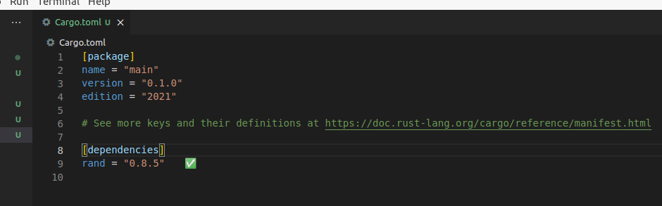

# 3.17.3 再谈crate
## 1. 创建二进制crate和库crate
可以被编译成可执行文件的crate就是二进制crate，它的代码中必定包含一个main函数。如下方式创建的就是一个二进制crate：

```bash
cargo new main
```

对于库crate的创建，需要加上--lib方式如下：

```bash
cargo new my-lib --lib
```

## 2. 使用第三方的crate
在Rust项目中，经常会使用第三方的crate。使用第三方的crate主要分为两步：
- 添加依赖；
- 在代码中使用。

下面以使用第三方crate rand为例，来进行演示。
### （1）首先创建一个工程：

```bash
cargo new main
```

### （2）添加依赖：

```bash
cd main
```

打开main目录下的Cargo.toml文件，在[dependencies]下添加对rand库的依赖（即添加语句rand = "0.8.5"），添加后整个文件的内容如下：



### （3）在代码中使用rand库
编写src/main.rs如下：

```rust
// src/main.rs
use rand::prelude::*;   // 引入rand库

fn main() {
    // 使用rand的函数
    let mut rng = rand::thread_rng();
    let y: f64 = rng.gen();
    println!("y = {:?}", y);
}
```

**重点说明**：在第二步中，当在Cargo.toml的[dependencies]添加rand = "0.8.5"后，程序编译时，会自动先去拉取rand库相关的内容，拉取完成后进行编译。
