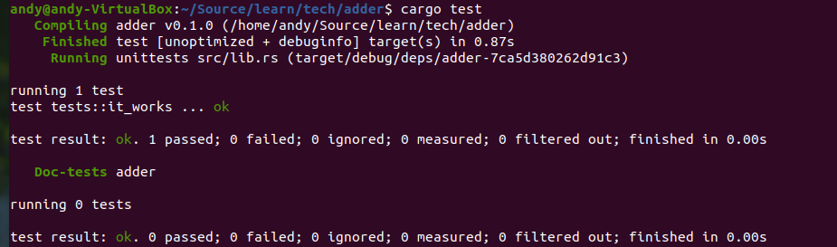

# 3.18.1 编写测试

## 1. 测试初体验

测试函数体通常执行如下三种操作：
- 设置需要的数据或者状态；
- 运行需要测试的代码；
- 断言结果是所期望的结果。

Rust提供了专门用来编写测试的功能，即test属性、一些宏和should_panic属性等。
Rust中的测试就是带有一个test属性注解的函数，使用Cargo创建一个新的库时，会自动生成一个测试模块和测试函数，这个模块就是一个编写测试的模板。下面进行演示：
### （1）创建一个库
运行如下命令生成一个库：

```bash
cargo new adder --lib
```

### （2）查看自动生成的测试模块
打开adder/src/lib.rs可以看到其中内容如下：

```rust
pub fn add(left: usize, right: usize) -> usize {
    left + right
}

//下面为一个测试模块，里面的测试函数it_works对上面的add函数进行测试
#[cfg(test)]
mod tests {
    use super::*;

    #[test]
    fn it_works() { // 这是一个测试函数，上面需要加上#[test]
        let result = add(2, 2);  // 调用被测试的函数
        assert_eq!(result, 4);   // 用断言进行判断结果
    }
}
```
上面的代码演示了如何写测试函数。

### （3）运行测试
在adder目录下运行如下命令来执行测试函数：

```bash
cargo test
```

运行后可以看到对应的测试结果：


## 2. 使用断言
在前面的示例中，测试代码中使用了assert_eq!断言。除了assert_eq!以外，下面几个也是比较常用的断言：
- assert!输入一个布尔值的参数，如果参数为true，断言成功，否则断言失败；
- assert_eq!输入两个参数，两个参数相等，断言成功，否则失败；
- assert_ne!输入两个参数，两个参数不等，断言成功，否则断言失败；

几个断言的使用示例如下：

```rust
pub fn add(left: usize, right: usize) -> usize {
    left + right
}

#[cfg(test)]
mod tests {
    use super::*;

    #[test]
    fn it_works() {
        let result = add(2, 2);
        assert!(result==4);   // 断言成功
        assert!(result==2);   // 断言将失败
        assert_eq!(result, 4); // 断言成功
        assert_eq!(result, 2); // 断言失败
        assert_ne!(result, 2); // 断言成功
        assert_ne!(result, 4); // 断言失败
    }
}
```

## 3. 使用should_panic!
可以使用should_panic!检查代码是否按照预期panic，示例如下：

```rust
pub struct Guess {
    value: i32,
}

impl Guess {
    pub fn new(value: i32) -> Guess {
        if value < 1 || value > 100 {
            panic!("Guess value must be between 1 and 100, got {}.", value);
        }

        Guess { value }
    }
}

#[cfg(test)]
mod tests {
    use super::*;

    #[test]
    #[should_panic]
    fn greater_than_100() {
        Guess::new(200);
    }
}
```

## 4. 使用Result
除了使用断言，还是可以使用Result类型。和断言不同的是，断言写在函数中，而Result类型则是作为测试函数的返回值，示例如下：

```rust
#[cfg(test)]
mod tests {
    #[test]
    fn it_works() -> Result<(), String> {  // Result类型作为it_works的返回值
        if 2 + 2 == 4 {
            Ok(())
        } else {
            Err(String::from("two plus two does not equal four"))
        }
    }
}
```
