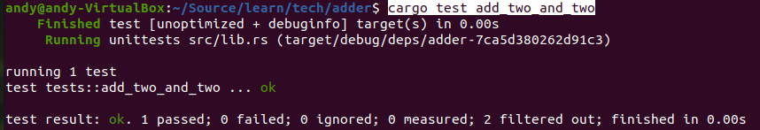
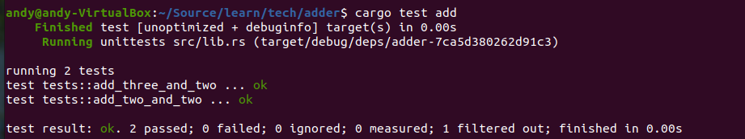

# 3.18.2 运行测试

上一节演示了如何编写测试，对于运行测试则只提到了简单的命令cargo test。本节对执行测试进行详细介绍。

## 1. 并行或连续运行测试

当运行多个测试时，Rust默认使用线程并行运行。如果不希望测试并行运行，或者更加精确的控制线程的数量，可以传递 --test-threads参数来控制，示例如下：

```bash
cargo test -- --test-threads=1  # 使用一个线程运行测试
```

## 2. 显示测试中的打印

有的时候，需要在运行测试时打印内容到标准输出，可以添加-- --nocapture或者-- --show-output，例如有如下代码：

```rust
pub fn add(left: usize, right: usize) -> usize {
    left + right
}

#[cfg(test)]
mod tests {
    use super::*;

    #[test]
    fn it_works() {
        let result = add(2, 2);
        println!("result = {:?}", result); // 打印到标准输出
        assert_eq!(result, 4); // 用断言进行判断结果
    }
}
```
要在运行测试时显示12行的打印，可以运行如下命令：

```bash
cargo test -- --nocapture
```
或者
```bash
cargo test -- --show-output
```

## 3. 运行单个测试

运行测试时，可以通过指定测试函数的名字来运行某个特定的测试函数。例如有如下测试代码：

```rust
pub fn add_two(a: i32) -> i32 {
    a + 2
}

#[cfg(test)]
mod tests {
    use super::*;

    #[test]
    fn add_two_and_two() {
        assert_eq!(4, add_two(2));
    }

    #[test]
    fn add_three_and_two() {
        assert_eq!(5, add_two(3));
    }

    #[test]
    fn one_hundred() {
        assert_eq!(102, add_two(100));
    }
}
```

通过指定函数名运行特定的测试函数，下面的命令只会运行函数add_two_and_two：

```bash
cargo test add_two_and_two
```

执行结果如下图：



## 4. 过滤运行测试

还可以指定部分测试的名称，任何名称匹配这个名称的测试会被运行。例如，因为上面的代码中，前两个测试的名称包含 add，则可以通过 cargo test add 来运行这两个测试：

```bash
cargo test add
```

执行结果如下图：



## 5. 忽略某个测试

有时候运行cargo test时想忽略其中的某个测试，此时可以通过使用ignore属性来标记该测试来排除它。例如有如下测试代码：

```rust
pub fn add_two(a: i32) -> i32 {
    a + 2
}

#[cfg(test)]
mod tests {
    use super::*;

    #[test]
    #[ignore] //通过添加ignore属性来排除改测试，运行cargo test将不会执行该测试函数
    fn add_two_and_two() {
        assert_eq!(4, add_two(2));
    }

    #[test]
    fn add_three_and_two() {
        assert_eq!(5, add_two(3));
    }

    #[test]
    fn one_hundred() {
        assert_eq!(102, add_two(100));
    }
}
```
上面的代码中将add_two_and_two用#[ignore]忽略，运行cargo test将不会执行该函数，执行结果如下：


