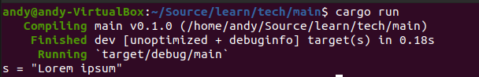

# 3.22.1 在Rust中调用C
## 1. 构建脚本build.rs

- 构建脚本build.rs简单使用

build.rs中可以进行真正的项目代码编译前需要的额外的工作，例如在编译前为项目生成对应的文件、代码，编译所依赖的外部语言库等。build.rs放置在正式代码的外面（也就是src的外面）。
下面示例在build.rs中生成一个文件，然后在正式的项目代码中读取这个文件，build.rs中的代码如下：
```Rust
// build.rs
use std::fs;

fn main() -> std::io::Result<()> {
    fs::write("foo.txt", b"Lorem ipsum")?; // 在build.rs生成文件foo.txt，并写入字符串
    Ok(())
}
```

src/main.rs中的代码如下：
```Rust
// src/main.rs
use std::fs;
fn main() {
    let s = fs::read_to_string("./foo.txt").expect("Read file error"); // 读取foo.txt文件
    println!("s = {:?}", s);
}
```

运行前整个项目的目录结构如下：


运行cargo run执行程序结果如下：



运行后整个项目的目录结构如下：


可以看到有一个foo.txt文件，该文件就是在build.rs中生成的。
