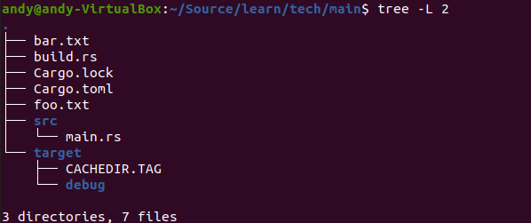

# 3.22.1 在Rust中调用C
## 1. 构建脚本build.rs

- 构建脚本build.rs简单使用

build.rs中可以进行真正的项目代码编译前需要的额外的工作，例如在编译前为项目生成对应的文件、代码，编译所依赖的外部语言库等。build.rs放置在正式代码的外面（也就是src的外面）。
下面示例在build.rs中生成一个文件，然后在正式的项目代码中读取这个文件，build.rs中的代码如下：

```rust
// build.rs
use std::fs;

fn main() -> std::io::Result<()> {
    fs::write("foo.txt", b"Lorem ipsum")?; // 在build.rs生成文件foo.txt，并写入字符串
    Ok(())
}
```

src/main.rs中的代码如下：

```rust
// src/main.rs
use std::fs;
fn main() {
    let s = fs::read_to_string("./foo.txt").expect("Read file error"); // 读取foo.txt文件
    println!("s = {:?}", s);
}
```

运行前整个项目的目录结构如下：


运行cargo run执行程序结果如下：


运行后整个项目的目录结构如下：




- 构建脚本的生命周期

在项目构建之前，Cargo会将build.rs编译成可执行文件，然后执行。在执行过程中，脚本可以使用println的方式跟Cargo进行通信，通信内容的格式为：cargo:真正的内容。

示例如下：

```rust
// build.rs
fn main() {
    println!("cargo:rustc-link-search=/usr/local/lib/");
    println!("cargo:rustc-link-lib=dylib=pcre2-8");
    println!("cargo:rerun-if-changed=src/lib.rs");
}
```

- 构建脚本的输入

可以通过环境变量、文件等方式给构建脚本提供一些输入。

- 构建脚本的输出

如果构建脚本生成文件，可以指定该文件的输入目录，可以通过设置OUT_DIR环境变量来指定。构建脚本的输出通常是用来告诉Cargo一些信息，以下几个为常用的Cargo能识别的通信指令：
  - cargo:rerun-if-changed=PATH — 当指定路径的文件发生变化时，Cargo会重新运行脚本；
  - cargo:rerun-if-env-changed=VAR — 当指定的环境变量发生变化时，Cargo会重新运行脚本；
  - cargo:rustc-link-lib=[KIND=]NAME — 告诉Cargo通过-l去链接一个指定的库，常用于FFI；
  - cargo:rustc-link-search=[KIND=]PATH — 告诉Cargo通过-L将一个目录添加到依赖库搜索路径中；
  - cargo:rustc-env=VAR=VALUE — 设置一个环境变量。

- 构建脚本的依赖

构建脚本也可以引入其它基于Cargo的依赖包，依赖方式为在Cargo.toml中添加依赖包，示例如下：

```TOML
# Cargo.toml

...

[build-dependencies]
cc = "1.0.46"     # 可以在build.rs中使用cc相关的功能
```

可以看到有一个foo.txt文件，该文件就是在build.rs中生成的。

## 2. 在Rust中调用C代码
在Rust中调用c的代码需要使用extern关键字来定义外部函数接口，即用extern块把c提供的函数接口进行封装。

下面的示例展示如何在Rust中使用c代码，整个项目的目录结构如下：


c目录中的pass.c为c代码，源码如下：

```C
// c/pass.c
#include <stdio.h>

void set_err(char *message) {   // 提供一个打印错误信息的函数
    printf("err: %s\n", message);
}
```

```Rust
src目录中为Rust代码，源码如下：
// ==================
// 封装c函数
extern "C" {   // 在Rust中调用c的代码需要使用extern关键字，定义外部函数接口，
               // 实际上就是: 用extern块将c提供的函数接口封装下
    fn set_err(message: *const libc::c_char);
}
// ==================

fn main() {
    let err = "some error".to_string();
    let c_err = std::ffi::CString::new(err).expect("error");
    unsafe {  // 需要unsafe块
        set_err(c_err.as_ptr());  // 调用封装的c函数
    }
}
```

build.rs中的内容如下：

```rust
// build.rs
fn main() {
    // 以下代码告诉 Cargo ，`c/pass.c`发生改变，就重新运行当前的构建脚本
    println!("cargo:rerun-if-changed=src/hello.c");

    // 使用 `cc` 来构建一个 C 文件，然后进行静态链接
    cc::Build::new()
        .file("c/pass.c")
        .compile("pass");
}
```

Cargo.toml中的内容如下：
```TOML
[package]
name = "use-c"
version = "0.1.0"
edition = "2021"

# See more keys and their definitions at https://doc.rust-lang.org/cargo/reference/manifest.html
[build-dependencies]
cc = "1.0.46"   # build.rs中依赖cc，所以此处需要添加

[dependencies]
libc = "0.2.139"  # src/main.rs中使用了libc这个库

```

可以使用cargo run对这个工程编译运行。
