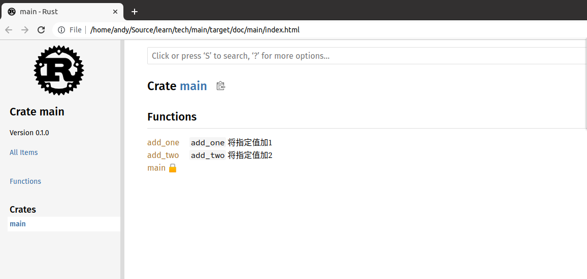

# 3.4 注释

在Rust中，注释分为三类：

- 代码注释，用于说明某一块代码功能，读者往往是同一项目的协作者；
- 文档注释，支持markdown，对项目、公共API等进行描述，同时还能提供示例代码，读者是想要了解你项目的人；
- 包和模块注释，文档注释的一种，用于说明当前包和模块的功能，方便用户迅速了解项目。

本节主要简单介绍代码注释和文档注释，对于注释的其它功能，我们后面再深入。

## 3.4.1. 代码注释

代码注释有两种：

（1）行注释，使用“//”；

（2）块注释，使用“/*... */”。

示例如下：

```rust
/*
 * 块注释：
 * 函数名：sum
 * 参数： a，b
 * 返回值类型： u32
 */
fn sum(a: u32, b: u32) -> u32 {
    a + b
}

fn main() {
    let a: u32 = 1;
    let b: u32 = 1;
    // 行注释：调用sum函数计算a+b的和
    let c = sum(a, b);
    println!("a + b is {:?}", c);
}
```

## 3.4.2.文档注释

Rust提供了cargo doc命令可以把文档注释转换成html网页，最终展示给用户。文档注释也有文档行注释和文档块注释：

（1）文档行注释，使用“///”;

（2）文档块注释，使用“/**...*/”。

示例如下：

```rust
// 下面是文档行注释

/// `add_one` 将指定值加1
///
/// # Examples
///
/// ```
/// let arg = 5;
/// let answer = my_crate::add_one(arg);
///
/// assert_eq!(6, answer);
/// ```
pub fn add_one(x: i32) -> i32 {
    x + 1
}

// 下面是文档块注释

/** `add_two` 将指定值加2


\```
let arg = 5;
let answer = my_crate::add_two(arg);

assert_eq!(7, answer);
\```
*/
pub fn add_two(x: i32) -> i32 {
    x + 2
}

fn main() {
    let a: i32 = 1;
    let c = add_one(a);
    println!("a + 1 is {:?}", c);

    let d = add_two(a);
    println!("a + 2 is {:?}", d);
}
```

运行如下命令：

```bash
cargo doc --open
```

将打开上面代码里面文档注释生成的文档，如下图：


