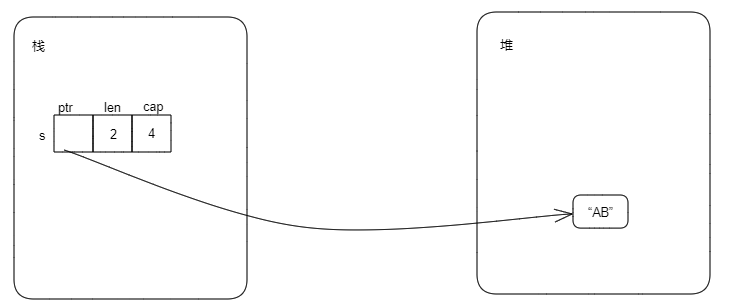
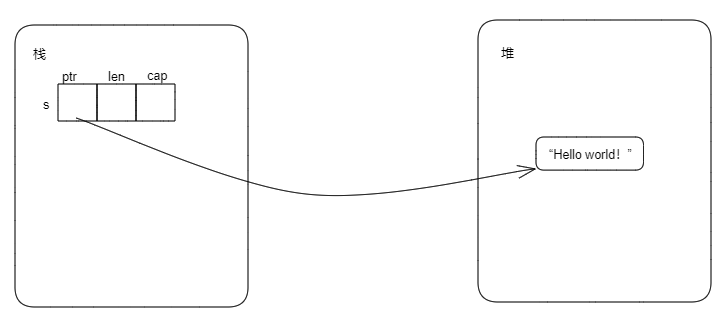

## 3.7.所有权(Ownership) ---------- andy
### 3.7.1 所有权介绍
所有权是Rust最为与众不同的特性，它让Rust无需垃圾回收即可保证内存安全。

#### 1. 所有权规则

Rust所有权的规则如下：

- Rust中的每个值都有一个被称为其所有者的变量，即值的所有者是某个变量；
- 值在任何时刻有且仅有一个所有者；
- 当所有者离开作用域后，这个值将丢弃。
```Rust
fn main() {
    let a: u32 = 8;
    let b: String = String::from("hello");
    let c: Vec<u8> = vec![1, 2, 3];
}
```

上面的代码中，a就是8的所有者，b是String::from("hello")的所有者，c则是vec![1, 2, 3]的所有者。

注意：b是String::from("hello")的所有者，但是b不是字符串"hello"的所有者。同理，c是vec![1, 2, 3]的所有者，但不是[1, 2, 3]的所有者。至于为什么，后续内容（String类型部分）会进行讲解。

#### 2. 变量的作用域
变量作用域是变量在程序中有效的范围。一对花括号表示的范围就是作用域，变量有效的范围就是从创建开始，到离开作用域结束。
示例1：
```Rust
fn f() {
    let b = 1u32;           // --------------------------------|
    let c = 2u32;           //-----------|                     |             
                            //           |                     |
                            //           |                     |---b的作用域范围
    println!("b = {:?}", b);//           |--c的作用与范围       |
    println!("c = {:?}", c);//           |                     |
                            //-----------|  -------------------|         
}

fn main() {
    let a: u32 = 8;   // ----------------------------|
    println!("a = {:?}", a);                      // |
                                                  // | ---- a 的作用域范围
    f();                                          // |
//---------------------------------------------------|
}
```

示例2：
```Rust
fn main() {
    let a = 8u32;                 // --------------------------|
    {                             //                           |
        let b = 5u32;             // -------|                  |
        println!("a = {:?}", a);  //        |--b的作用域范围    |
        println!("b = {:?}", b);  //        |                  |-----a的作用域范围
                                  // -------|                  |
    }                             //                           |
    println!("a = {:?}", a);      //                           |
                                  // --------------------------|
}
```

#### 3. String类型

- String类型的创建

  - String::from
  - to_string
  - String::new
```Rust
fn main() {
    let s1 = String::from("Hello");  // 方法一
    let s2 = "Hello".to_string();    // 方法二

    let mut s3 = String::new();      // 方法三
    s3.push('H');
    s3.push('e');
    s3.push('l');
    s3.push('l');
    s3.push('o');
    s3.push('!');

    println!("s1: {:?}", s1);
    println!("s2: {:?}", s2);
    println!("s3: {:?}", s3);
}
```

- String类型的本质

Rust标准库中，String类型的定义如下：
```Rust
pub struct String {
    vec: Vec<u8>,
}
```
Vec类型的定义如下：
```Rust
pub struct Vec<T> {
    buf: RawVec<T>,  
    len: usize,      // 长度
}
```
RawVec定义则类似于如下（为了更好的说明String类型，下面的定义用简化的代码）：
```Rust
struct RawVec<T> {
    ptr: NonNull<T>,    // 指针
    cap: usize,         // 容量
}
```
那对于整个String类型，可以用伪代码表示如下：
```Rust
struct String {
    v: struct Vec<u8> {
            raw_vec: RawVec{ptr: NonNull<u8>, cap: usize},
            len: usize,
        }
}
```
更进一步的简化，可以得到String类型本质如下：
```Rust
struct String {
    ptr：NonNull<u8>, 
    cap: usize，
    len: usize,
}
```
所以String类型本质是三个字段：一个指针，一个容量大小，一个长度大小。

- 内存分配

在Rust中，编译时大小确定的数据放在栈上，编译时大小不能确定的数据放在堆上。考虑如下代码：
```Rust
fn main() {
    let mut s = String::new();
    s.push('A');
    s.push('B');

    println!("{s}");  // 打印AB
}
```
在第2行定义String类型时，并不能确定最终字符串的大小，所以字符串内容本身应该存储在堆上。结合什么String类型的本质的内容，可以得到String类型的存储如下：


String类型本身是三个字段（指针、长度、容量），在编译时是已知的大小，存储在栈上；String类型绑定的字符串（在上面代码中是“AB”）在编译时大小未知，是运行时在堆上分配内存，分配后的内存地址保存在String类型的指针字段中，内存大小保存在cap字段中，内存上存储的字符串长度保存在len字段中。

#### 4. move语义
Rust所有权规则第二条，在任意时刻，值有且仅有一个所有者。那么当一个变量赋给另外一个变量时发生了什么？

- 完全存储在栈上的类型

考虑如下代码：
```Rust
fn main() {
    let x = 5u32;
    let y = x;
    println!("x: {:?}, y: {:?}", x, y);
}
```
x和y都是u32类型，在编译时知道大小，都存储在栈上。代码第2行是将5绑定到变量x上，第3行则是通过自动拷贝的方式将5绑定到y上（先拷贝x的值5，然后将拷贝后得到的5绑定到y上）。所以，当let y = x发生后，这段代码里面最后有两个值5，分别绑定到了x和y上。

- 涉及到堆存储的类型

再考虑如下代码：
```Rust
fn main() {
    let s = "Hello world!".to_string();
    let s1 = s;
    // println!("s: {:?}", s);   // 此行打开编译将报错
    println!("s1: {:?}", s1);
}
```
s是String类型，字符串“Hello world！”是存储在堆内存上的，其内存布局如下：

当执行let s1 = s后，内存布局如下：

