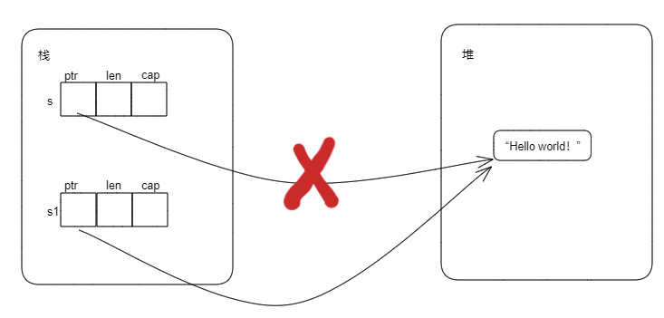

# 3.7.1 所有权介绍

所有权是Rust最为与众不同的特性，它让Rust无需垃圾回收即可保证内存安全。

## 1. 所有权规则

Rust所有权的规则如下：

- Rust中的每个值都有一个被称为其所有者的变量，即值的所有者是某个变量；
- 值在任何时刻有且仅有一个所有者；
- 当所有者离开作用域后，这个值将丢弃。

```rust
fn main() {
    let a: u32 = 8;
    let b: String = String::from("hello");
    let c: Vec<u8> = vec![1, 2, 3];
}
```

上面的代码中，a就是`8`的所有者，b是`String::from("hello")`的所有者，c则是`vec![1, 2, 3]`的所有者。

注意：b是`String::from("hello")`的所有者，但是b不是字符串`"hello"`的所有者。同理，c是`vec![1, 2, 3]`的所有者，但不是`[1, 2, 3]`的所有者。至于为什么，后续内容（String类型部分）会进行讲解。

## 2. 变量的作用域

变量作用域是变量在程序中有效的范围。一对花括号表示的范围就是作用域，变量有效的范围就是从创建开始，到离开作用域结束。

示例1：

```rust
fn f() {
    let b = 1u32;           // --------------------------------|
    let c = 2u32;           //-----------|                     |
                            //           |                     |
                            //           |                     |---b的作用域范围
    println!("b = {:?}", b);//           |--c的作用与范围       |
    println!("c = {:?}", c);//           |                     |
                            //-----------|  -------------------|
}

fn main() {
    let a: u32 = 8;   // ----------------------------|
    println!("a = {:?}", a);                      // |
                                                  // | ---- a 的作用域范围
    f();                                          // |
//---------------------------------------------------|
}
```

示例2：

```rust
fn main() {
    let a = 8u32;                 // --------------------------|
    {                             //                           |
        let b = 5u32;             // -------|                  |
        println!("a = {:?}", a);  //        |--b的作用域范围    |
        println!("b = {:?}", b);  //        |                  |-----a的作用域范围
                                  // -------|                  |
    }                             //                           |
    println!("a = {:?}", a);      //                           |
                                  // --------------------------|
}
```

## 3. String类型

### 3.1 String类型的创建有下面三种方式：

- `String::from`
- `to_string`
- `String::new`

```rust
fn main() {
    let s1 = String::from("Hello");  // 方法一
    let s2 = "Hello".to_string();    // 方法二

    let mut s3 = String::new();      // 方法三
    s3.push('H');
    s3.push('e');
    s3.push('l');
    s3.push('l');
    s3.push('o');
    s3.push('!');

    println!("s1: {:?}", s1);
    println!("s2: {:?}", s2);
    println!("s3: {:?}", s3);
}
```

### 3.2 String类型的本质

Rust标准库中，String类型的定义如下：

```rust
pub struct String {
    vec: Vec<u8>,
}
```

Vec类型的定义如下：

```Rust
pub struct Vec<T> {
    buf: RawVec<T>,
    len: usize,      // 长度
}
```

RawVec定义则类似于如下（为了更好的说明String类型，下面的定义用简化的代码）：

```Rust
struct RawVec<T> {
    ptr: NonNull<T>,    // 指针
    cap: usize,         // 容量
}
```

那对于整个String类型，可以用伪代码表示如下：

```Rust
struct String {
    v: struct Vec<u8> {
            raw_vec: RawVec{ptr: NonNull<u8>, cap: usize},
            len: usize,
        }
}
```

更进一步的简化，可以得到String类型本质如下：

```Rust
struct String {
    ptr：NonNull<u8>,
    cap: usize，
    len: usize,
}
```

所以String类型本质是三个字段：一个指针，一个容量大小，一个长度大小。

### 3.3 内存分配

在Rust中，编译时大小确定的数据放在栈上，编译时大小不能确定的数据放在堆上。考虑如下代码：

```rust
fn main() {
    let mut s = String::new();
    s.push('A');
    s.push('B');

    println!("{s}");  // 打印AB
}
```

在第2行定义String类型时，并不能确定最终字符串的大小，所以字符串内容本身应该存储在堆上。结合什么String类型的本质的内容，可以得到String类型的存储如下：


String类型本身是三个字段（指针、长度、容量），在编译时是已知的大小，存储在栈上；String类型绑定的字符串（在上面代码中是“AB”）在编译时大小未知，是运行时在堆上分配内存，分配后的内存地址保存在String类型的指针字段中，内存大小保存在cap字段中，内存上存储的字符串长度保存在len字段中。

## 4. move语义

Rust所有权规则第二条，在任意时刻，值有且仅有一个所有者。那么当一个变量赋给另外一个变量时发生了什么？

### 4.1 完全存储在栈上的类型

考虑如下代码：

```rust
fn main() {
    let x = 5u32;
    let y = x;
    println!("x: {:?}, y: {:?}", x, y);
}
```

x和y都是u32类型，在编译时知道大小，都存储在栈上。代码第2行是将5绑定到变量`x`上，第3行则是通过自动拷贝的方式将5绑定到`y`上（先拷贝`x`的值5，然后将拷贝后得到的5绑定到y上）。所以，当`let y = x`发生后，这段代码里面最后有两个值5，分别绑定到了`x`和`y`上。

### 4.2 涉及到堆存储的类型

再考虑如下代码：

```rust
fn main() {
    let s = "Hello world!".to_string();
    let s1 = s;
    // println!("s: {:?}", s);   // 此行打开编译将报错
    println!("s1: {:?}", s1);
}
```
s是`String`类型，字符串`"Hello world"`是存储在堆内存上的，其内存布局如下：


当执行let s1 = s后，内存布局如下：



当`let s1 = s`执行后，就发生了所有权的转移，String类型值的所有权从`s`转移到了`s1`。此时Rust认为原来的`s`不再有效。因此，上面代码第4行打开编译将会出错。

## 5. 浅拷贝与深拷贝

### 5.1 浅拷贝

只拷贝栈上的内容，就叫做浅拷贝。
对于上面的String类型，执行`let s1 = s`后，只把`s`的`ptr`、`len`、`cap`中的值拷贝给`s1`的`ptr`、`len`、`cap`的值，这种就叫做浅拷贝。浅拷贝发生后，`s`的`ptr`和`s1`的`ptr`都指向同样的堆内存。内存布局如下：


### 5.2 深拷贝

除了拷贝栈上的内容外，还拷贝堆内存中的内容，就叫做深拷贝。
对于上面的String类型，执行`let s1 = s`后，除了把`s`的`len`、`cap`中的值拷贝给`s1`的`len`、`cap`外，还在堆上重新分配一块内存，将s的ptr指向的堆内存的内容拷贝到这块内存，然后`s1`的`ptr`指向这块内存，这种拷贝就叫做深拷贝。深拷贝发生后，`s`的`ptr`和`s1`的`ptr`指向不同的堆内存，但是堆内存中存储的内容一样。深拷贝发生后的内存布局如下：


显然，**Rust中变量赋值（Rust中叫所有权转移）使用的是浅拷贝**。

## 6. Clone

当需要拷贝堆上的数据时，可以使用`clone`方法，完成深拷贝的操作，如下：

```rust
fn main() {
    let s = "Hello world!".to_string();
    let s1 = s.clone(); // 这将发生深拷贝
    println!("s: {:?}", s);
    println!("s1: {:?}", s1);
}
```
不过不是所有的类型都能使用`clone`方法进行深拷贝，只有实现了`Clone trait`的类型才能调用该方法。

## 7. Copy

按照Rust所有权规则第二条，**在任意时刻，值有且仅有一个所有者**。所以当`let b = a`发生时，就将变量`b`拥有的值移到了`a`上，此时`a`应该回到未初始状态，但实际情况并不一定。不一定的原因是，部分类型实现了`Copy trait`，在值移动时会对值进行自动拷贝，能让变量a仍拥有原来的值。

Rust中，默认实现了`Copy trait`的类型有：

- 所有整数类型，比如`u32`；
- 所有浮点数类型，比如`f64`；
- 布尔类型，`bool`，它的值是`true`和`false`；
- 字符类型，`char`；
- 元组，当且仅当其包含的类型也都是`Copy`的时候。比如`(i32, i32)`是Copy的，但`(i32, String)`不是；
- 数组，当且仅当其包含的类型也都是`Copy`的时候。比如`[i32; 5]`是Copy的，但`[String; 5]`不是；
- 共享指针类型或共享引用类型。

## 8. 所有权和函数

### 8.1 将值传给函数

在将值传递给函数时，和变量赋值一样会发生值的移动（或复制），如下：
```rust
fn main() {
    let s = String::from("hello");
    takes_ownership(s);
    // println!("s: {:?}", s);//打开编译会报错，因为s的所有权在上一行已经转移到take_ownership函数中了

    let x = 5;
    makes_copy(x);
    println!("x: {:?}", x);//不会报错，因为上一行将x传到makes_copy函数时会自动拷贝x的值到函数中
}

fn takes_ownership(some_string: String) {
    println!("{}", some_string);
}

fn makes_copy(some_integer: i32) {
    println!("{}", some_integer);
}
```

### 8.2 返回值和作用域

函数的返回值也可以转移所有权，如下：

```rust
fn main() {
    let s1 = gives_ownership();         // gives_ownership 将返回值转移给 s1
    let s2 = String::from("hello");     // s2 进入作用域
    let s3 = takes_and_gives_back(s2);  // s2 被移动到takes_and_gives_back 中，
                                        // 它也将返回值移给 s3
} //这里，s3移出作用域并被丢弃。s2也移出作用域，但已被移走，所以什么也不会发生。s1离开作用域并被丢弃

fn gives_ownership() -> String {// gives_ownership 会将返回值移动给调用它的函数
    let some_string = String::from("yours"); // some_string 进入作用域。
    some_string                              // 返回 some_string 并移出给调用的函数
}

// takes_and_gives_back 将传入字符串并返回该值
fn takes_and_gives_back(a_string: String) -> String { // a_string 进入作用域
    a_string  // 返回 a_string 并移出给调用的函数
}
```

**关于所有权的总结：将值赋给另一个变量时移动它。当持有堆中数据值的变量离开作用域时，其值将通过 drop函数（后续讲解） 被清理掉，除非数据被移动为另一个变量所有。**
