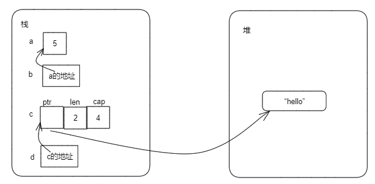

### 3.7.2 引用与借用
考虑如下代码：
```Rust
fn main() {
    let s2 = String::from("hello");
    print(s2);
    // println!("s2 is {:?}", s2);  //打开报错，s2的所有权在上一行已经移动到print函数，
                                    //此处无法再使用
}

fn print(s: String) {
    println!("s is: {:?}", s);
}
```
第4行打开注释编译将发送错误，因为s2的所有权在第3行已经转移到print函数中了，s2将不再有效，因此第4行不能再使用。

如果要在调用print函数后仍然能使用s2，根据本书目前学过的Rust知识，则需要将所有权再从函数转移到变量，然后使用，代码如下：
```Rust
fn main() {
    let s2 = String::from("hello");
    let s3 = print(s2);
    println!("s3 is {:?}", s3);
}

fn print(s: String) -> String {
    println!("s is: {:?}", s);
    s  //将s的所有权返回
}
```
除了这种转移所有权的方式外，Rust还提供了引用的方式可以借用数据的所有权。

#### 1. 引用与借用
引用本质上是一个指针，它存储一个地址，通过它可以访问存储在该地址上属于其它变量的数据。与指针不同的是，引用确保指向某个特性类型的有效值。对于一个变量的引用就是在此变量前面加上&符合。
```Rust
    let a = 5u32;
    let b = &a;    // b是对a的引用

    let c = String::from("hello");
    let d = &c;    // d 是对c的引用
```
上面代码中，变量a、b、c、d的内存布局如下：


